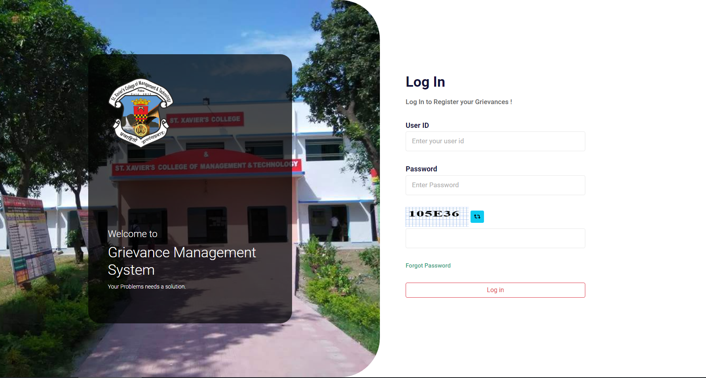
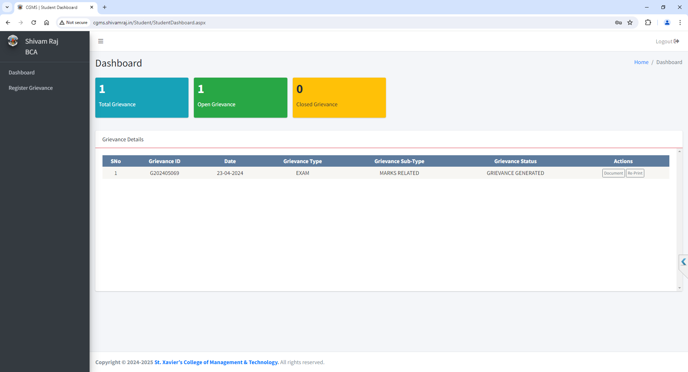
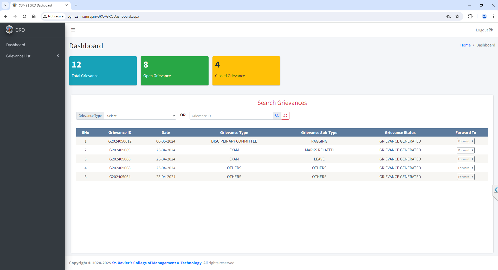
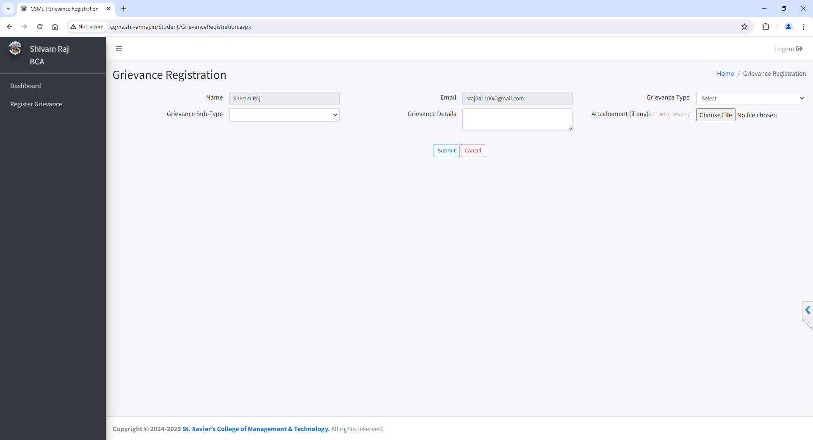
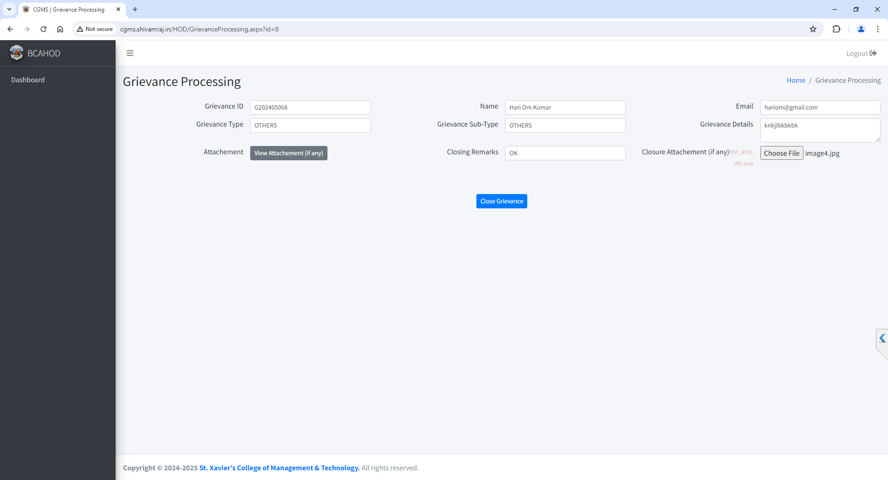

<p align="center">
  
</p>

<h1 align="center">🎓 College Grievance Management System (CGMS)</h1>

<p align="center">
  A Web-Based Grievance Redressal Platform for Educational Institutions
</p>

<p align="center">
  <a href="http://projects.cgms.shivamraj.in">
    
  </a>
  <a href="https://github.com/sraj041100/CGMS">
    
  </a>
</p>

<p align="center">
  
  
  
  
</p>

---

## 📖 About The Project

The **College Grievance Management System (CGMS)** is a web-based application developed to digitize and streamline the grievance handling process in educational institutions.

The platform enables students to submit grievances online, upload supporting documents, and track the status of their complaints in real time. Administrators can efficiently review, process, and resolve grievances through a centralized dashboard.

The system eliminates paperwork, improves transparency, and significantly reduces the time required for grievance resolution.

---

## ✨ Features

### 👨‍🎓 Student Module
- Student Registration & Login
- Submit Grievances Online
- Upload Supporting Documents
- Track Complaint Status
- View Complaint History
- Profile Management

### 👨‍💼 Admin Module
- Complaint Management Dashboard
- View and Process Grievances
- Search & Filter Complaints
- Update Complaint Status
- Generate Reports
- Manage Student Records

### 🔒 Security Features
- Role-Based Authentication
- Session Management
- CAPTCHA Verification
- Secure Database Access

---

## 🛠️ Tech Stack

### Frontend
- HTML5
- CSS3
- Bootstrap
- JavaScript
- jQuery

### Backend
- ASP.NET Web Forms
- C#
- ADO.NET

### Database
- Microsoft SQL Server

### Tools
- Visual Studio 2022
- SQL Server Management Studio (SSMS)
- Git & GitHub

---

## 🚀 Live Demo

🌐 **Website:** http://projects.cgms.shivamraj.in

---

## 📸 Screenshots

### Login Page
<p align="center">
  
</p>

### Student Dashboard
<p align="center">
  
</p>

### GRO Dashboard
<p align="center">
  
</p>

### Register Grievance
<p align="center">
  
</p>

### Grievance Management
<p align="center">
  
</p>

---

## 📂 Project Structure

```text
CGMS
│
├── App_Code
├── Content
├── Scripts
├── Images
├── Pages
├── screenshots
├── database
│   └── cgms_23042024.bak
├── web.config
├── CGMS.sln
└── README.md
```

---

## ⚙️ Installation

### Clone the Repository

```bash
git clone https://github.com/sraj041100/CGMS.git
cd CGMS
```

### Restore Database

1. Open SQL Server Management Studio.
2. Right Click → Databases → Restore Database.
3. Select:

```text
database/cgms_23042024.bak
```

4. Restore the database.

---

### Configure Connection String

Open `web.config` and update:

```xml
<connectionStrings>
  <add name="CGMSConnection"
       connectionString="Data Source=YOUR_SERVER;
       Initial Catalog=CGMS;
       Integrated Security=True"
       providerName="System.Data.SqlClient"/>
</connectionStrings>
```

---

### Run the Project

```text
Open CGMS.sln
Press F5
```

---

## 🎯 Objectives

- Digitize grievance handling.
- Reduce paperwork.
- Increase transparency.
- Enable real-time complaint tracking.
- Improve administrative efficiency.

---

## 🔮 Future Enhancements

- Email Notifications
- SMS Alerts
- Mobile Application
- Department Analytics Dashboard
- AI-Based Complaint Categorization
- Complaint Priority System

---


## ⭐ Show Your Support

If you found this project useful, please consider giving it a ⭐ on GitHub.

<p align="center">
  <a href="https://github.com/sraj041100/CGMS">
    
  </a>
</p>

---

<p align="center">
  Made with ❤️ by <b>Shivam Raj</b>
</p>
